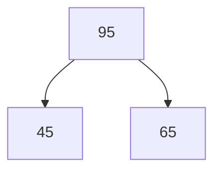
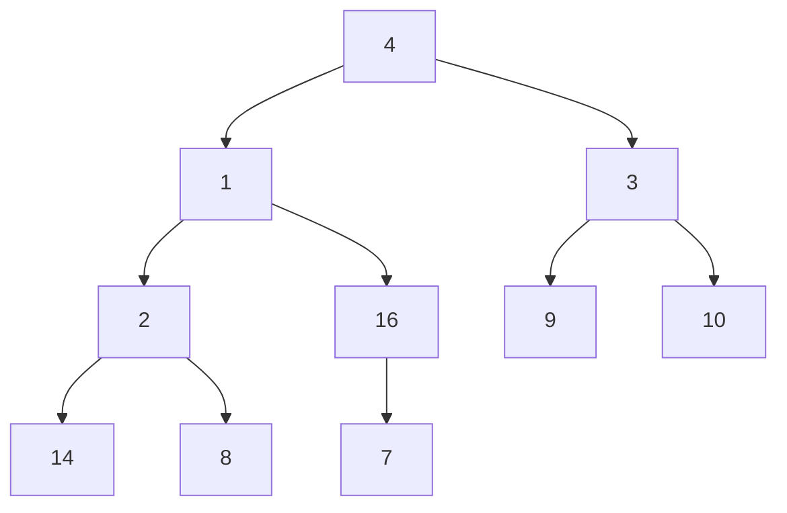
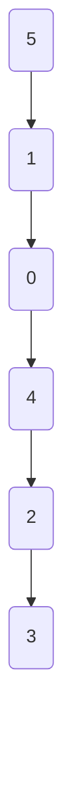
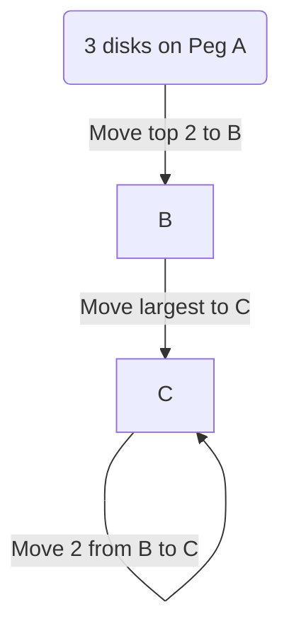
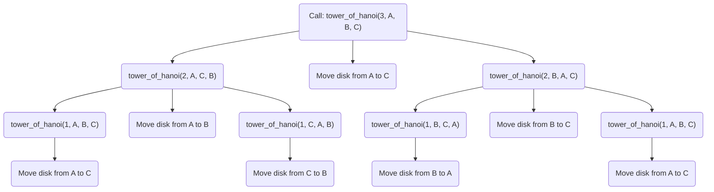

# Notes on Heaps and Recursion

---

### Binary Tree and Heap Insertion Complexity

- When inserting a Python list into a heap, the typical approach involves inserting each element individually, which takes $O(n \log n))$, as each insertion operation has a logarithmic complexity, $(O(\log n))$.
- However, there is an optimal way to achieve this in $(O(n))$.

---

### Why Use a Heap?

A heap is advantageous in certain scenarios due to the following properties:

- It allows for efficient retrieval of minimum or maximum values (depending on min-heap or max-heap).
- Operations like insertion and deletion can be handled in logarithmic time, $O(\log n)$.

For example, in a min-heap:

- **Accessing Min/Max:** $(O(1))$
- **Deleting Min/Max:** $(O(\log n))$

Mermaid diagram for visualizing a simple max-heap:



---

### Bottom-Up Heap Construction

- When building a heap from a list, we can start from the bottom of the tree to the top.
- For a given list `a = [4, 1, 3, 2, 16, 9, 10, 14, 8, 7]`, constructing from bottom-up requires less time due to fewer percolations.

Example diagram:



The heap height $( h )$ is $( \log_2 n )$, and each level from bottom to top has decreasing numbers of percolations.

---

### Complexity Analysis of Bottom-Up Heap Building

The formula for calculating the sum of percolations $( S )$ is:

1. Initial equation:

$$

S = h + 2(h - 1) + 4(h - 2) + 8(h - 3) + \dots

$$

1. Multiply by 2 and simplify to reach:

$S = 2n = O(n)$

Thus, building a heap from bottom-up takes  $O(n)$  time.

---

### Testing Heap Property: Max-Heap Example

To ensure a structure follows the max-heap property, retrieve elements from the heap one by one using `heap.top()` and `heap.deleteTop()`. For a max-heap, the elements should appear in descending order, while for a min-heap, they would appear in ascending order.

Python code example to validate max-heap property:

```python
import heapq

def test_max_heap(heap):
    sorted_list = []
    while heap:
        top = heapq.heappop(heap)
        print(f"Top element: {top}")
        sorted_list.append(top)
    print("Descending order:", sorted_list[::-1])

# Example heap
heap = [-8, -7, -6, -4, -3, -2, -1]  # Using negative values to simulate max-heap
heapq.heapify(heap)
test_max_heap(heap)

```

Output:

```
Top element: -8
Top element: -7
Top element: -6
...
Descending order: [8, 7, 6, 4, 3, 2, 1]

```

---

### Heap Sort

Heap sort can be verified by checking if the final list obtained after extraction is sorted. If it is, the heap is working as expected. This is known as **heap sort**.

---

### Using Python's `heapq` Library

To use `heapq`:

```python
import heapq

class Node:
    def __init__(self, a: int, b: int):
        self.a = a
        self.b = b

    def __lt__(self, rhs: 'Node') -> bool:
        return self.a < rhs.a

```

All classes should have an `__init__` function. For heaps, we primarily need the `__lt__` (less than) operator to compare elements.

---

### Custom Heap Class in Python

```python
import heapq

class MyHeap:
    def __init__(self):
        self.q = []

    def insert(self, a):
        for e in a:
            n = Node(e, e)
            heapq.heappush(self.q, n)

    def add(self, n: Node):
        heapq.heappush(self.q, n)

    def get_top(self) -> 'Node':
        return self.q[0]

    def delete_all(self):
        while self.q:
            n = heapq.heappop(self.q)
            print(n.a, n.b)

# Usage example
my_heap = MyHeap()
my_heap.insert([1, 3, 5, 7, 9])
my_heap.delete_all()

```

---

### Recursion

**Why Recursion?**

1. Simplifies problems with repetitive substructure.
2. Reduces code length by breaking down a problem into smaller, similar problems.

**Example:** Calculating factorial using recursion vs. iteration.

**Iterative Factorial Function**

```python
def factorial_iter(n: int) -> int:
    if n < 2:
        return 1
    s = 1
    for i in range(2, n + 1):
        s *= i
    return s

print(factorial_iter(5))  # Output: 120

```

**Recursive Factorial Function**

```python
def factorial_recursive(n: int) -> int:
    if n == 1:
        return 1
    return n * factorial_recursive(n - 1)

print(factorial_recursive(5))  # Output: 120

```

Output tracing for `factorial_recursive(5)`:

1. `factorial_recursive(5)` calls `factorial_recursive(4)`
2. `factorial_recursive(4)` calls `factorial_recursive(3)`
3. `factorial_recursive(3)` calls `factorial_recursive(2)`
4. `factorial_recursive(2)` calls `factorial_recursive(1)`
5. `factorial_recursive(1)` returns 1

## Factorial Calculation Using Recursion

The recursive factorial function is defined as follows:

```python
def fact(n: int) -> int:
    if n < 2:
        return 1
    return fact(n - 1) * n

```

When the function is called, a stack is built in the background. Here’s the trace for `fact(5)`:

- $( n = 5 \rightarrow \text{calls } 5 \times \text{fact}(4))$
- $( n = 4 \rightarrow \text{calls } 4 \times \text{fact}(3) )$
- $( n = 3 \rightarrow \text{calls } 3 \times \text{fact}(2))$
- $( n = 2 \rightarrow \text{calls } 2 \times \text{fact}(1) )$
- $( n = 1 \rightarrow \text{returns } 1 )$

The recurrence relation is  $T(n) = T(n-1) + C$  with base case  $T(1) = 1$ . This is characteristic of a **recursive function**.

---

### Stack Overflow and Recursive Efficiency

Recursion's cost is linear in space $( \Theta(n) )$ and time $\Theta(n)$ if we call recursively for every decrement. **Stack overflow** occurs if there is no optimization and the recursion depth becomes too large.

Recursion's cost is linear in space  $\Theta(n)$  and time $\Theta(n)$  if we call recursively for every decrement. **Stack overflow** occurs if there is no optimization and the recursion depth becomes too large.

An alternative is using **logarithmic recursion**. For example, if a problem can be reduced by half each time, the recursion depth can be  $O(\log n)$.

Example: $n = 1,000,000,000$ requires only 30 recursive calls if each call reduces $n$  by half.

---

### Iterative Approach for Digit Extraction

Task: Print each digit of a number from the least significant (rightmost) to the most significant (leftmost).

```python
def F(n: int):
    if n == 0:
        print(0)
        return
    while n:
        print(n % 10)
        n //= 10

```

For example, given $( n = 1986)$, the output will be:

```
6
8
9
1

```

---

### Recursive Approach for Digit Extraction

To achieve the same result in reverse (starting from the most significant digit), modify the recursive structure to ensure numbers are printed after each recursive call.

```python
def F(n: int):
    if n < 10:
        print(n)
        return
    F(n // 10)
    print(n % 10)

```

### Time Complexity

The iterative and recursive approach both have a time complexity of $( O(\log_{10} n) )$.

---

### Number Reversal Example

Task: Reverse a number, say  $n = 1986$ , resulting in  $6891$ .

To reverse a number iteratively:

```python
def reverse_number(n: int) -> int:
    s = 0
    while n:
        s = s * 10 + n % 10
        n //= 10
    return s

# Trace for 1986:
# 1986 → 6 → 68 → 689 → 6891

```

---

### Recursive Approach with Helper Function

Using recursion to reverse a number requires an intermediate function to accumulate the reversed digits.

```python
def reverse_recursive(n: int, s: int = 0) -> int:
    if n == 0:
        return s
    return reverse_recursive(n // 10, s * 10 + n % 10)

print(reverse_recursive(1986))  # Output: 6891

```

---

### Hop Problem

Problem: Given an array, determine how many steps it takes to "hop" to a target element in the array by following indices.

Example Array: `[5, 1, 0, 4, 2, 3]`

Diagram:



Code to solve the hop problem iteratively:

```python
def hop(arr, target):
    t = arr[0]
    hops = 0
    while True:
        if arr[t] == target:
            return hops
        else:
            t = arr[t]
            hops += 1

# Example usage
arr = [5, 1, 0, 4, 2, 3]
print(hop(arr, 3))  # Output: the number of hops to reach target 3

```

---

## Tower of Hanoi - Introduction

The **Tower of Hanoi** problem is a classic example of an $( O(2^n))$ algorithm, illustrating exponential complexity. The problem setup includes three pegs:

1. **Source** (A) - where all disks start.
2. **Temporary** (B) - an auxiliary peg.
3. **Destination** (C) - where all disks should end up.

Rules:

- Move only one disk at a time.
- A disk can only be placed on top of a larger disk or an empty peg.

### Example with 3 Disks

Steps:

1. Move disk from A → C
2. Move disk from A → B
3. Move disk from C → B
4. Move disk from A → C
5. Move disk from B → A
6. Move disk from B → C
7. Move disk from A → B

Total: 7 moves for 3 disks.

### Complexity with More Disks

If there are 64 disks, the minimum number of steps required is $( 2^{64} - 1)$, which is computationally infeasible for large $( n )$ due to exponential growth.

---

### Recursive Solution for Tower of Hanoi

Let  $n$ be the number of disks,  $s$  the source peg,  $t$  the temporary peg, and  $d$  the destination peg. The recursive solution involves:

1. Moving $( n-1)$ disks from **source** to **temporary** using **destination** as auxiliary.
2. Moving the largest disk from **source** to **destination**.
3. Moving $(n-1)$ disks from **temporary** to **destination** using **source** as auxiliary.

```python
def tower_of_hanoi(n, source, temp, dest):
    if n == 1:
        print(f"Move disk from {source} to {dest}")
    else:
        tower_of_hanoi(n - 1, source, dest, temp)
        print(f"Move disk from {source} to {dest}")
        tower_of_hanoi(n - 1, temp, source, dest)

```

For $( n = 3 )$, this outputs:

```
Move disk from A to C
Move disk from A to B
Move disk from C to B
Move disk from A to C
Move disk from B to A
Move disk from B to C
Move disk from A to C

```

### Diagram



---

### Recurrence Relation for Tower of Hanoi

The recurrence relation for the Tower of Hanoi problem is:
$T(n) = 2 \times T(n-1) + 1$
with base case:
$T(1) = 1$

This expands as follows:

1. $T(1) = 1$ 
2.  $T(2) = 2 \times T(1) + 1 = 3 = 2^2 - 1$ 
3.  $T(3) = 2 \times T(2) + 1 = 7 = 2^3 - 1$ 
4.  $T(4) = 2 \times T(3) + 1 = 15 = 2^4 - 1$ 

General formula:
\$T(n) = 2^n - 1$

## Tower of Hanoi - Recursive Algorithm and Stack Trace

**Problem Setup:**
The Tower of Hanoi problem requires moving disks from a source peg (A) to a destination peg (C) using an auxiliary peg (B) following these rules:

1. Only one disk can be moved at a time.
2. A disk can only be placed on an empty peg or on top of a larger disk.

**Recursive Solution:**
The recursive steps are as follows:

1. Move \( n-1 \) disks from **Source (A)** to **Auxiliary (B)** using **Destination (C)** as an intermediary.
2. Move the nth disk from **Source (A)** to **Destination (C)**.
3. Move the \( n-1 \) disks from **Auxiliary (B)** to **Destination (C)** using **Source (A)** as an intermediary.

**Python Code:**

```python
def tower_of_hanoi(n, source, auxiliary, destination):
    if n == 1:
        print(f"Move disk 1 from {source} to {destination}")
        return
    tower_of_hanoi(n - 1, source, destination, auxiliary)
    print(f"Move disk {n} from {source} to {destination}")
    tower_of_hanoi(n - 1, auxiliary, source, destination)

# Example usage for 3 disks
tower_of_hanoi(3, 'A', 'B', 'C')

```

**Output:**

```
Move disk 1 from A to C
Move disk 2 from A to B
Move disk 1 from C to B
Move disk 3 from A to C
Move disk 1 from B to A
Move disk 2 from B to C
Move disk 1 from A to C

```

**Mermaid Diagram for Recursive Stack (Example for 3 Disks):**



---

### Complexity Analysis for Tower of Hanoi

The recurrence relation for the Tower of Hanoi problem is:
$T(n) = 2 \times T(n - 1) + 1$
The closed-form solution for this recurrence relation is $T(n) = 2^n - 1$, which grows exponentially with the number of disks $( n )$.

---

### HOP Recursive Implementation

**Problem Description:**
The HOP problem involves navigating an array using indices until a target index is reached. The recursive function modifies the array temporarily to avoid infinite loops by marking visited indices, then restores the array after backtracking.

**Recursive Function:**

```python
def hop(a, f):
    if a[f] == f:
        return 0
    previous = a[f]
    a[f] = a[a[f]]  # Temporarily modify array to prevent revisiting
    result = hop(a, f) + 1
    a[f] = previous  # Restore the original array
    return result

```

**Call Stack Visualization and Trace:**

This trace represents the recursive stack and shows how the array is modified and restored during recursion. Here is a simplified trace for understanding:

Given array `a = [5, 1, 0, 4, 2, 3]` and target index `f = 3`, the function will recursively hop through indices as follows:

- **Initial Call**: `hop([5, 1, 0, 4, 2, 3], 3)`
    - Check if `a[3] == 3`. If true, end recursion. Else, hop to `a[a[3]]`.
    - Temporarily modify array.
    - Recursive calls continue until reaching base condition.
